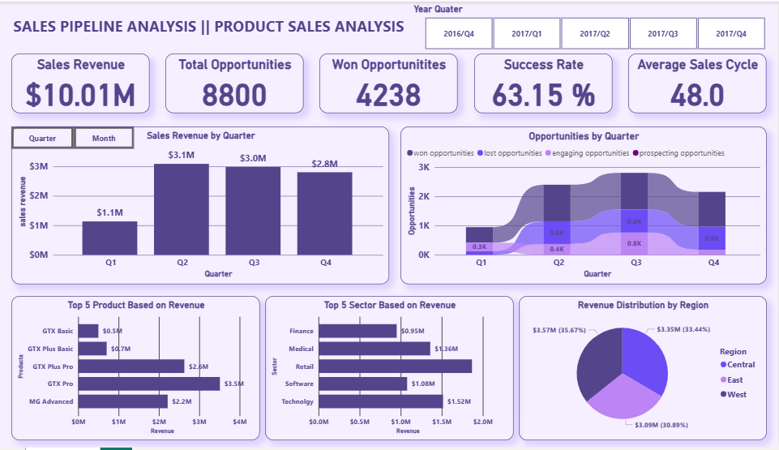

# 📊 Sales Pipeline & Product Performance Dashboard

This Power BI dashboard gives a clear, high-level view of how the sales pipeline and product performance are shaping up over time. It’s designed to help teams and decision-makers quickly understand what’s working, where the challenges are, and where to focus next.

---

### 🔎 What the Dashboard Shows

* **Sales Revenue by Quarter**
  Easily track how revenue is trending across quarters and spot peaks and dips in performance.

* **Opportunities Breakdown**
  See how many deals are won, lost, in progress, or still in early stages—giving you a sense of pipeline health at a glance.

* **Top Products & Sectors**
  Know which products are bringing in the most revenue and which sectors are most profitable.

* **Regional Performance**
  Understand how different regions (Central, East, and West) are contributing to overall sales.

* **Sales Efficiency Metrics**
  Includes success rate and average sales cycle duration to highlight how efficient your sales process is.

---

### 💼 Why This Dashboard Matters

Whether you're a sales leader, product manager, or executive, this dashboard helps you:

* **Make smarter, data-backed decisions** by showing what’s driving revenue.
* **Spot bottlenecks or drop-offs** in the sales funnel before they become bigger issues.
* **Prioritize efforts** on the right products, sectors, and regions.
* **Track performance over time** and quickly communicate insights with your team.

---

Built using **Power BI**, this dashboard is designed for clarity, speed, and impact—turning raw sales data into meaningful business insights.

---
